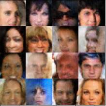

# face_generation
This project uses Generative Adversarial Networks(GANs) to generate new images of faces.

### Data
Two datasets are used in this project:-
- MNIST :: The [MNIST](http://yann.lecun.com/exdb/mnist/) dataset contains images of handwritten digits.
- CelebA :: The [CelebFaces Attributes Dataset (CelebA)](http://mmlab.ie.cuhk.edu.hk/projects/CelebA.html) dataset contains over 200,000 celebrity images with annotations. Since we're going to be generating faces, we won't need the annotations.

## Files and folders into the repository : -
* ### dlnd_face_generation.ipynb
This notebook contains the actual code for the whole project to implement Generative Adversarial Network(GAN) model to generate new images.
* ### dlnd_face_generation.html
This is the equivalent html file for the notebook.
* ### helper.py
This python file contains the code for helper functions which are used for various tasks such as 'pre-processing' the images, 'loading pre-processed images from the directory' and batching.
* ### problem_unittests.py
This python files contains code to perform unit tests for the code which we have written. This is good way to verify the code after each meaningful step.

#### Below are the images (training and the generated ones) from both the datasets

Training|Generated       
:-----: | :-----:
|
|

### Dependencies
The code uses tensorflow 1.0 or later version.
Python version 3

### Good luck...
