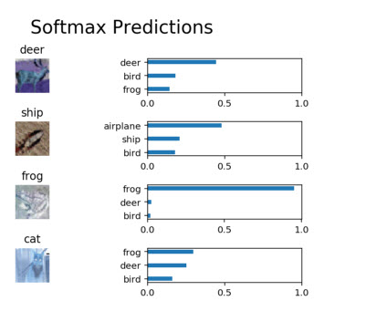

# image-classification
In this project, you'll classify images from the [CIFAR-10 dataset](https://www.cs.toronto.edu/~kriz/cifar.html).  The dataset consists of airplanes, dogs, cats, and other objects. You'll preprocess the images, then train a convolutional neural network on all the samples. The images need to be normalized and the labels need to be one-hot encoded.  You'll get to apply what you learned and build a convolutional, max pooling, dropout, and fully connected layers.  At the end, you'll get to see your neural network's predictions on the sample images.

## Get the Data
Data used for the training purpose is available at the location [CIFAR-10 dataset for python](https://www.cs.toronto.edu/~kriz/cifar-10-python.tar.gz).

## Files and folders into the repository : -
* ### dlnd_image_classification.ipynb
This notebook contains the actual code for the whole project to implement Convolutional-Neural_Network(CNN) model to classify images.
* ### dlnd_image_classification.html
This is the equivalent html file for the notebook.
* ### helper.py
This python file contains the code for helper functions which are used for various tasks such as 'pre-processing' the images, 'loading pre-processed images from the directory' and batching.
* ### problem_unittests.py
This python files contains code to perform unit tests for the code which we have written. This is good way to verify the code after each meaningful step.

#### Below are the image-predictions which this model has done..

### Dependencies
The code uses tensorflow 1.0 or later version.
Python version 3

### Good luck...
